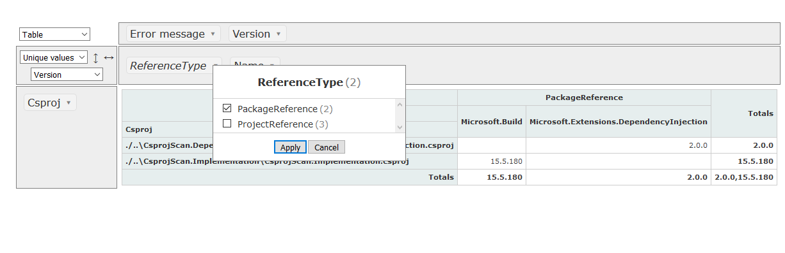

# CsprojScan

CsprojScan scans folders for csproj files and extracts all project references, package references and references (directly referenced DLLs).
It exports the references to a CSV file to be visualized in a HTML pivot table. It allows for simple analysis of all references and NuGet packages over different solutions which is very useful when you have many different solutions sharing packages and / or references you want to compare.

# Usage

`CsprojScan.Console.exe <search-paths> [<search-pattern>]`

**<search-paths>** is the start search path. Multiple paths can be separated by ; (no whitespaces allowed)

optional **<search-pattern>** (defaults to *.csproj)}

CsprojScan then scans all given search paths by using the given search pattern and exports the results to a file in CSV format. 
It also generates a html file using the pivottable.js library from https://pivottable.js.org/ and opens it. 
The pivot table html is configured to load the generated CSV file. 
The name of the pivot table HTML file is auto generated and follows the pattern **<pivotgrid>_<Ticks>.html**
The name of the CSV file is auto generated and follows the pattern **<export>_<Ticks>.csv**
The exported files are created in the application directory.

